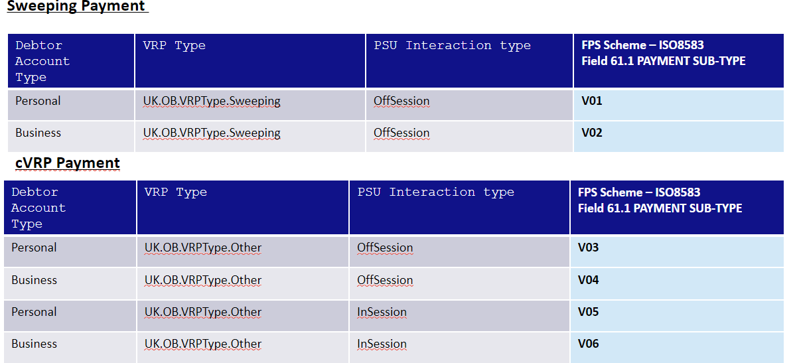

# Variable Recurring Payments / Sweeping FAQs

[[toc]]

## **Sweeping**

### **Where can we find the definition of sweeping?**

The Competition and Markets Authority (CMA) has published further clarification on the definition of sweeping. You can view this [here](https://assets.publishing.service.gov.uk/media/622ef71fd3bf7f5a86be8fa4/Sweeping_clarification_letter_to_be_sent_14_March_2022__.pdf). Please also refer to CEG - [Definition of VRP for sweeping](https://standards.openbanking.org.uk/good-practice/vrp-for-sweeping-guidelines/latest/)

### **Where can I find more clarification on destination accounts?**

Several questions have arisen regarding the interpretation of this clarification, so OBL has published answers to key questions, which can be downloaded from [here](https://www.openbanking.org.uk/news/questions-and-answers-on-the-definition-of-sweeping/)

#### **What should a party do if it disputes that a transaction or use case is sweeping?**

Please refer to Point 9 [here](https://www.openbanking.org.uk/news/questions-and-answers-on-the-definition-of-sweeping/).

#### **Where can we find Sweeping requirements?**

Refer to Proposition - [Proposition - Variable Recurring Payments (VRPs) | 9.-Requirements-for-VRP-Sweeping-Access](https://openbanking.atlassian.net/wiki/spaces/DZ/pages/1939243099/Proposition+-+Variable+Recurring+Payments+VRPs#9.-Requirements-for-VRP-Sweeping-Access)

#### **Where can we find VRP for Sweeping Access Journey?**

Refer to CEG - [VRP Payments under Sweeping Access] (https://standards.openbanking.org.uk/customer-experience-guidelines/payment-initiation-services/vrp-payments-under-sweeping-access/latest/)

#### **Where can we find more information on dashboards for VRP/sweeping**

- Refer to CEG - [PIS-VRP Consent Dashboard](https://standards.openbanking.org.uk/customer-experience-guidelines/dashboards/vrp-consent-dashboard-revocation/latest/)
- Refer to CEG - [PIS-VRP Access Dashboard](https://standards.openbanking.org.uk/customer-experience-guidelines/dashboards/pis-vrp-access-dashboard-revocation/latest/)

#### **Who is responsible to prove that the consent is sweeping consent and payment is made to the same customer or legal entity as the initiating account?**

The PISP asserts it is sweeping and so would need to be able to prove that it is if questioned.

### **Is event notification mandatory for sweeping when the linked account is no longer available either temporarily or permanently?**

This is **optional** under the current versions of the specifications. However, the functionality can be supported.

#### **What if an account linked to a VRP consent is no longer available (temporarily or permanently)?**

It is recommended that the ASPSP inform the TPP using events. Note, events is **mandatory** for CMA9 ASPSPs, but remains **optional** under the current version of the specifications for other ASPSPs, who are encouraged to support where possible.

#### **Is there a specific VRP type for sweeping?**

Yes, the current enumerations include one specifically for sweeping (`sweeping`).

#### **Can ASPSP allow only `Sweeping` VRP type?**

Yes, ASPSPs can currently choose to only support VRP Type `sweeping`.  

#### **Does a PISP need to display T&Cs as part of a sweeping consent journey?**

Yes, there is a CEG checklist requirement where the PISP **must** ensure that the PSU sees the T&Cs while giving sweeping consent.

#### **Is it mandatory to include Creditor account details as part of a Sweeping VRP consent?**

Yes, creditor account details **must** be specified and cannot be changed.

#### **Should a PISP ask the PSU to re-consent or re-authenticate if no payments have been taken for a period of time?**

The PISP **may** ask the PSU to re-authenticate at any time if required but if there is a long-lived consent given by the PSU to the PISP then the token **should** be valid for the duration of the consent.

#### **Can an ASPSP revoke access token if there are no payments made for a period of time?**

No, the ASPSP **must not** revoke access tokens given to a PISP solely because no payments have been made using the VRP consent for a set amount of time.  The PISP **must** ensure they have the appropriate consent from the PSU to initiate a payment order within a VRP consent (see "Setting the appropriate consent parameters" section in VRPs for Sweeping Guidance document). Ensuring appropriate management of potentially dormant VRP consents **should** form part of the PISPs operational risk management processes.

## **VRP**

### **Can PSU revoke VRP consent at the PISP?**

Yes. The PISP **must** provide a mechanism within their domain and/or via the VRP merchant to enable the PSU to revoke their consent for initiation of any future payment orders, by revoking the authorisation of VRP consent. 

### **Does a PISP need to mark the consent status as ‘Revoked’ once the PSU has revoked consent at the PISP?**

Once the PSU revokes consent at the PISP, the PISP **must** use the `DELETE` endpoint to inform the ASPSP that consent is revoked. The ASPSP **must** delete the resource and respond to subsequent GET requests with an HTPP status of 400.

### **Can a PSU re-authenticate the same consent after revoking at the PISP?**

No. The PSU **must** give a new consent to the PISP and go through a new authentication journey at their ASPSP in order to set up a new VRP consent.

### **Can a PSU re-authenticate the same consent after revoking access at the ASPSP?**

Yes. The PISP **must** take the PSU to the ASPSP to re-authenticate the same consent, however, the PISP/PSU **must not** change any parameters previously agreed upon within the consent.

### **Can PSU revoke the VRP payment order once it has been initiated by the PISP?**

No, the specifications do not support the revocation of a payment order once it has been initiated by the PISP (as contemplated in PSR 83(2))  Note that this is different from revoking a VRP consent - this can be done at any point in time by the PSU. When a VRP consent is revoked, payments that are in-flight (ie initiated but not yet completed) may still get paid. The exact behaviour of such payments may differ between ASPSPs.

### **Can PSU revoke VRP access at ASPSP?**

ASPSPs **must** provide a mechanism within their domain to enable the PSU to revoke their VRP consent access. This will not revoke any inflight VRP payments orders that have already been initiated by the PISP, but will preclude the initiation of future payment orders within the VRP consent.

### **Can an ASPSP revoke VRP consent for any reason?**

ASPSPs **must not** revoke VRP consent given by the PSU to the PISP. They **must not** change the status of the consent either. They **must**, however, take necessary action to revoke access e.g. by revoking/expiring the access token provided to the PISP or any other action that will stop the PISP from accessing the PSU’s account and making payment using the specific VRP consent, when requested to by the PSU.

### **Can a PSU re-authenticate use an existing VRP consent and what would be the trigger situations for these?**

There may be exceptional circumstances (e.g. suspect risk or fraud situations) where the PSU will be required to undergo strong customer authentication at their ASPSP, following the initial VRP consent set up. In instances where the ASPSP has revoked the access token, the PSU will need to go through a re-authentication journey.

### **Where can the PSU select their debtor account at ASPSP for the VRP consent?**

There are two ways in which PSU can provide their debtor account. The debtor account can firstly be provided in the domain of the PISP as part of the consent journey or alternatively in the domain of the ASPSP as part of the authentication journey, where the ASPSP will present the PSU with an option to select an account.

### **How does a PISP ensure that the source and destination account belong to the same PSU while performing a sweeping activity?**

The PISP **must** ensure that they have satisfied themselves that source and destination accounts belong to the same PSU, including instances where account selection happens at the ASPSP. It is in the competitive space of each PISP to ensure that they have created the appropriate mechanism to achieve this based on their service offering. PISPs **must** ensure that they attest that the activity is sweeping when making VRP payments in this context.

### **Can the ASPSP apply ‘Transfer to Self’ exemption over ‘Trusted Beneficiary’ SCA exemption when the PSU is transferring funds between their own accounts at the same ASPSP?**

Yes, the ASPSP may apply ‘Transfer to Self’ over ‘Trusted Beneficiary’ or any other relevant SCA exemption if it is more appropriate.

Note: The [VRP payments under sweeping access](https://standards.openbanking.org.uk/customer-experience-guidelines/payment-initiation-services/vrp-payments-under-sweeping-access/latest/) journey in CEG, demonstrates an example where sweeping is happening between two accounts of the same PSU but at different ASPSP and hence Trusted Beneficiary SCA exemption is demonstrated.

### **What proof do ASPSPs need to provide to PISP in order to claim money back from customer disputes?**

The regulatory requirements relating to ASPSP and PISP disputes, including the burden of proof are outlined in the PSRs. While OBL is unable to provide advice on this issue, there is useful information on this in the June 2019 [FCA Approach document, specifically in paragraphs (8.189 -8.330)](https://www.fca.org.uk/publication/finalised-guidance/fca-approach-payment-services-electronic-money-2017.pdf) 

### **Do ASPSPs need to differentiate between sweeping VRPs and non-sweeping VRPs from a customer perspective?**

No, as long as the requirements for sweeping and non-sweeping are met.

### **Can an ASPSP issue an open-ended access token or should they also issue a refresh token?**

ASPSPs **must** either issue a refresh token that is long-lived (expiring in line with the consent expiry), which the PISP can use to request an access token when the access token is short lived, or **must** issue a long-lived access token that expires along with the consent expiry, in which case a refresh token is not required.

### **Is event notification mandatory for non-sweeping when the linked account is no longer available either temporarily or permanently?**

This is optional under the current versions of the specifications. However, the functionality can be supported.

### **What if an account linked to a VRP consent is no longer available (temporarily or permanently)?**

It is only a recommendation that the ASPSP inform the PISP using events.

### **Are there different authentication methods that a PISP can indicate as part of VRP consent?**

The PISP **may** specify a PSU authentication method within the VRP consent. The PISP **must** specify the specific ‘PSU authentication method’ applied for each individual payment.

<ul><li>Authentication not required - indicates authentication is not required for individual payments and payments can be made without the PSU being present. This is useful for sweeping but may be used for other situations.</li>

<li>SCA by TPP - This indicates SCA is carried out by the PISP. However, the ASPSP and PISP are expected to have a contract in place to accept this method.</li></ul>

### **How does PISP attest that the VRP consent is sweeping or non-sweeping?**

The specifications can support both sweeping and non-sweeping as part of one consent. The PISP can indicate all the types of payments that can be made under a specific VRP consent including sweeping payment or other payments. However, the ASPSP and PISP will likely need to have a contract in place to accept sweeping and non-sweeping in one consent.

### **Can ASPSP define their specific list of VRP types for non-sweeping?**

There are two enumerations in the current specifications; `sweeping` and `other`. Please contact UKPI for details of enumerations supporting cVRP.  The exact usage of these will be determined by the MLA. ASPSPs **may** also define enumerations that are more specific and make this information available to PISPs.

### **Can a PISP specify a list of authentication methods for a single VRP payment?**

No, the PISP **must** provide one authentication method from the acceptable list of authentication methods that the PISP indicated at the VRP consent level. 

### **Does a PISP need to display T&Cs as part of the VRP consent journey?**

Yes, there is a CEG checklist requirement where the PISP **must** ensure that the PSU sees the T&Cs while giving VRP consent.

### **Are the creditor account details mandatory as part of the VRP consent for non-sweeping?**

For VRP there are two ways in which a VRP can be set up:

1. [VRP Payments with an SCA exemption](https://standards.openbanking.org.uk/customer-experience-guidelines/payment-initiation-services/vrp-payments-with-an-sca-exemption/latest)  - creditor (payee) details are fixed in the VRP consent

2. [VRP Payments with delegated SCA](https://standards.openbanking.org.uk/customer-experience-guidelines/payment-initiation-services/vrp-payments-with-delegated-sca/latest/) - creditor (payee) details are not part of the VRP consent but have to be specified each time VRP payment is initiated by the PISP.  

### **Can an ASPSP reject a VRP consent request from PISP if the creditor details are not provided and there is no appropriate contract in place between the PISP and the ASPSP?**

Yes.

### **Can a PSU give multiple VRP/sweeping consent to pay the same beneficiary?**

Yes, there is no limit on the number of consents a PSU can give to a PISP to pay the same beneficiary.  There is also no limit on the PSU paying the same beneficiary via multiple PISPs.

### **What if a PSU has given multiple consents to a PISP to pay the same beneficiary with different periodic limits (e.g. one with `Max amount per consent year` and other with `Max amount per calendar month`)?**

Each consent **should** be treated as a separate consent and not in conjunction.  It should be noted that a single consent may contain more than one periodic limit (e.g. a daily value limit and a weekly value limit and a monthly value limit) 

### **Are VRP and sweeping payments, domestic single immediate payments?**

Yes

### **What is the maximum number of transactions expected to show on the Access Dashboard History?**

It is up to the ASPSP. However, it would be recommended to keep it consistent with how many transactions the PSU would see on their online portal.

### **Will VRP be extended to BACS/CHAPS for non-FPS enabled accounts?**

There are no plans at present to extend VRP capability to non-FPS enabled accounts.

### **If no payment is made using a VRP/sweeping consent for over 13 months, is it appropriate that the consent remains active and who is expected to monitor?**

There is no 13-month dormancy rule applicable for PISP payments (including VRPs). The consent must remain active unless `ValidToDateTime` has expired, or the PSU revokes consent, or the PISP cancels the consent. 

### **When a VRP payment is refunded (total amount or partial amount), should the ASPSP or PISP recalculate the pending amount per period limits?**

No

### **If VRP consent is revoked OR account access revoked OR consent expired, can the PISP check the status of a payment that was initiated when the consent was still active?**

Yes, the PISP **may** use the GET endpoint to check the status of the payment, enabling the PISP to get the information using the client credentials grant.

### **Can an ASPSP ask the PSU to re-authenticate if the trusted beneficiary was removed and need to be added back to the PSU’s trusted list?**

Yes, the creation of or amendment of a trusted beneficiary list requires SCA.  If the PSU has removed the payee from their trusted beneficiary (payee) list on their online channel after setting up a VRP/sweeping consent, the ASPSP will need the PSU to re-authenticate in order to enable future VRPs to that trusted beneficiary.  

### **Are multi-auth VRPs supported?**

No, VRPs that require multiple authorisations are currently out of scope. This may be revisited by OBL.

## **Consent Parameters**

### **What are VRP control parameters?**

VRP control parameters are a set of controls associated with a specific VRP consent that determine the maximum amount of an individual payment, the aggregate value of payments in a specified time period, and optionally an end-date for the consent.  This is agreed by the PSU in conjunction with their merchant counterparty (where relevant) and the PISP, and conveyed to the ASPSP, where the PSU authorises the agreed parameters.

### **Whose responsibility is it to agree on the parameters?**

It is the responsibility of the PISP to ensure the PSU explicitly agrees to the limits imposed by the control parameters.  For example: A VRP consent may have one parameter as `Max Individual amount` which is set to £100 which means the PISP can initiate payments up to £100 at a given time, and another parameter of `Max amount per calendar month` which is set to £1000 which means the PISP can initiate payments that total up to not more than £1000 in a calendar month.

### **Whose responsibility is it to ensure payments are within the control parameters?**

It is the responsibility of the PISP to ensure that VRP payments are initiated within the control parameters. It is the responsibility of the ASPSP to ensure that it does not execute VRP payment orders outside of the control parameters. 

### **Can a PISP specify ‘Maximum cumulative amount per month /day/year etc’?**

Yes, the specifications are flexible to set dynamic control parameters as below:

<ul><li>Max cumulative amount per calendar day
<li>Max cumulative amount per consent day
<li>Max cumulative amount per calendar week
<li>Max cumulative amount per consent week
<li>Max cumulative amount per consent fortnight
<li>Max cumulative amount per calendar month
<li>Max cumulative amount per consent month
<li>Max cumulative amount per calendar halfyear
<li>Max cumulative amount per consent halfyear
<li>Max cumulative amount per calendar year
<li>Max cumulative amount per consent year</li></ul>

### **Do ASPSPs need to support all periodic limits for VRP/sweeping consent?**

For Sweeping VRP CMA9 ASPSPs **must** support all the periodic limits (day, week, fortnight, month, half-year, year) and all periodic alignment (consent and calendar). Other ASPSPs offering Sweeping VRP should support them all, but this is not mandatory. For cVRP, please refer to UKPI.

Note: `Maximum cumulative amount per calendar fortnight` is not recommended as the ISO calendar does not support or provide any guidance on when a fortnight should start.

### **Do PISPs need to support all periodic limits for VRP/sweeping consent?**

It is not mandatory that PISPs support all the periodic limits (day, week, fortnight, month, half-year, year) and all periodic alignment (consent and calendar).  Support will be predicated on the use-cases an individual PISP wants to support.

### **Do ASPSPs need to support all periodic limits as part of a single VRP/sweeping consent?**

For Sweeping VRP CMA9 ASPSPs **must** support all the periodic limits and be capable to handle multiple periodic limits in a single consent. Other ASPSPs should include details of what they support in their developer portals.  For cVRP, support for all periodic limits and periodic alignments is mandatory.

ASPSPs may restrict to one-period alignment (i.e. consent or calendar) for a single periodic limit in a single consent. For example: `Max cumulative amount per calendar year` and `Max cumulative amount per consent year` may not be an acceptable combination in one VRP consent however, `Max cumulative amount per calendar year` and `Max cumulative amount per consent month` is acceptable. 

### **Is the ASPSP able to limit the number of periodic limits in a single consent?**

The ASPSP **must** be able to support the number of periodic limits that the PISP includes in a VRP consent.  The maximum number of periodic limits that a PISP could include is 6 (one for each time period).  

### **Where can I find examples on periodic limits and periodic type?**

Examples of both consent and calendar types are in the specifications - [Domestic VRP consents - v4.0](https://openbankinguk.github.io/read-write-api-site3/v4.0/resources-and-data-models/vrp/domestic-vrp-consents.html) 

### **Who should specify the control parameter limits - PSU or PISP?**

This is something that PISPs agree with the PSU.  PISPs **should** ensure that the control parameters they agree with the PSU are appropriate for use cases and PSU’s individual circumstances. 

PISPs **must** either allow PSUs to specify control parameters or pre-populate them for the PSUs enabling the PSU to amend any of them as required. 

### **Can the periodic alignments be mixed and matched?**

Yes. For example: `Max cumulative amount per calendar year` and `Max cumulative amount per consent month` may be set in one VRP consent. 

### **Does the PISP need explicit permission i.e. consent from the PSU on all the control parameters?**

Yes, in order for the PSU to provide their explicit consent to set up a VRP/sweeping payment, the PISP **must** present all the required control parameters to ensure that they obtain explicit consent from the PSU and any subsequent payments are initiated within those consent parameters. The PISP **must** also ensure that the control parameters are ‘sufficiently narrow’ and in line with the service offering. 

### **Does the PISP need to ensure each VRP/sweeping payment is within the control parameters linked to the PSU’s consent?**

Yes, the PISP **must not** submit payment orders that are outside of the control parameters. 

### **Can an ASPSP define additional control parameters for non-sweeping?**

The standard provides a set of control parameters that may be specified as part of the VRP consent. These control parameters set limits for the payment orders that can be created by the PISP for a given VRP.

In addition to the control parameters defined in this standard ASPSPs may implement additional control parameters, limits and restrictions for non-sweeping VRPs.  These restrictions should be documented on ASPSP's developer portal.

### **Can an ASPSP define additional control parameters for sweeping?**

No, not for sweeping.

### **Where VRP consent does not start on the first day of the calendar date, is it expected to calculate first-period payment as pro-rata?**

Yes. If the Period Alignment is `Calendar` the Max amount figure **must** be calculated for the remaining days within the first period.  For example: `Max amount per calendar month` is set to £31 and `ValidFromDateTime` is 15/10/2025, then the maximum allowable amount that can be paid under the consent during the month of October 2025 will be £17. Thereafter up to £31 can be paid each month.

### **Can ASPSP reject a VRP/sweeping consent request, if the `MaximumIndividualAmount` exceeds the individual transaction limit on their online channels?**

The ASPSP **should not** put restrictions when the consent is set up but should apply account restrictions when the payment order is submitted and not process that payment if it exceeds the limit on their online channels.

### **Whose responsibility is it to set a limit on the length of the consent - PSU, TPP or ASPSP?**

All the consent parameters **must** be agreed upon between the PISP and the PSU, and the PSU has to give explicit consent.

### **While calculating the periodic limit amount, do ASPSPs and PISPs need to exclude the payments that have Rejected status?**

Yes, ASPSPs and PISPS should exclude those with `Rejected` status.

### **Does VRP payment support standing order/future dated payment?**

The sequence diagram [Variable recurring payments API profile v4.0](https://openbankinguk.github.io/read-write-api-site3/v4.0/profiles/vrp-profile.html#sequence-diagram) is generic. At present only single immediate payments are supported in the specifications, standing orders and forward dated payments are not supported.

### **Is the `Data.DebtorAccount` block to be provided by the ASPSP in the response block optional?**

`Data.DebtorAccount` block is **conditional** and outside the initiation block. In scenarios where account selection is done by the PSU during authentication, the ASPSP **must** update the `Data.DebtorAccount` block with the debtor details after successful authorisation. This will enable the PISP to use the debtor account details in any future payments using the VRP consent.

### **Where can I find namespaced enumerations for VRP?**

You can find all the namespaced enumerations for VRP here → [OB Internal Codeset](https://github.com/OpenBankingUK/External_Internal_CodeSets)

### **Does VRP support refunds? If yes, wherein the specs can we find this option?**

The PISP can request refund information by indicating yes/no in [Domestic VRP consents - v4.0](https://openbankinguk.github.io/read-write-api-site3/v4.0/resources-and-data-models/vrp/domestic-vrp-consents.html#obdomesticvrpconsentrequest) `Data.ReadRefundAccount`.  Note, the ASPSP will provide the PISP with the the account details of the original PSU payer.  The PISP/merchant can then use this to initiate a push payment to the original payer.

### **Why is the `FundsConfirmationId` max length 40?**

`FundsConfirmationId` - is a maximum of 40 characters.  This supports identifiers such as a UUIDv4 (36-38 characters), used in modern systems.

### **As per the specs, `ValidFromDateTime` field is optional. Does that mean the consent start date can be a back or a future date?**

`ValidFromDateTime` is an **optional** field which means if not provided the consent start date is when the consent is provided to the PISP by the PSU and successful authentication has taken place at the ASPSP. It **must not** be backdated because the PSU is only giving consent at that point. However, it could be a future date.

### **Can `ValidToDateTime` be left blank?**

`ValidToDateTime` can be left blank which means the validity of the consent is indefinite. 

### **Should the `ValidToDateTime` be populated by either the PISP or ASPSP when the consent is revoked?**

No consent parameters remain unchanged and so does ValidToDateTime even after the expiry of the consent. 

### **Is there an expectation that `ValidFromDateTime` and `ValidToDateTime` must start at a specific time and does that need to be included in the pro-rata calculation?**

Refer to specs section - OBDomesticVRPControlParameters - [Domestic VRP consents - v4.0](https://openbankinguk.github.io/read-write-api-site3/v4.0/resources-and-data-models/vrp/domestic-vrp-consents.html#obdomesticvrpcontrolparameters)

The time element of the date **should** be disregarded in computing the date range and pro-rating.

### **Is `Expired` a valid consent status?**

Yes, Once consent is expired, the PISP will not be able to access the PSU’s account to initiate payment orders however the status of the resource may be marked as 'Expired' by the ASPSP and same reflects on the access dashboard.

### **Is `Revoked` a valid consent status?**

No, this was introduced in v3.1.8 of the specifications but has been removed in v3.1.9 and later versions of the specifications. Once consent is revoked by the PSU at the PISP, the PISP **must** ensure the `DELETE` endpoint is called to inform the ASPSP that consent is revoked. The ASPSP **must** delete the resource and respond to subsequent GET requests with an HTPP status of 400.

### **Can an ASPSP provide a specific status reason if the VRP/sweeping payment cannot be processed due to asynchronous check failure?**

No, but this is being considered. 

### **Do PISPs have to provide the same `Reference` in the CoF check call as in the VRP consent?**

Yes. `Reference` is an **conditional** field in the VRP consent which means if it is provided, then it has to be provided in the CoF check call and the ASPSP can reject CoF request if the reference does not match.

### **What is a VRP Marker? What are the supported types?**

VRP markers have been introduced and defined by Pay.UK to identify and gather MI for different types of VRP payments. The various types that are required are classified in the below table.

Note: V05 and V06 has been reserved for ‘attended’ payments, although most VRPs will be ‘unattended’ at this time. 

### **Who is required to provide the VRP Marker?**

ASPSPs **must** provide a VRP Marker when each VRP payment is submitted to the Faster Payments Central Infrastructure. OBL has enhanced existing guidance around VRP markers for PISPs and ASPSPs to support this requirement. 

### **Is there a marker for normal non VRP open banking payments?**

Yes. All the non-VRP open banking payments must have the marker [A**].  

### **What if the sending ASPSP cannot derive the VRP marker due to insufficient information provided by the PISP?**

The ASPSP **must** provide sufficient clarification on their developer portal for PISPs to provide the necessary information.

### **Should the ASPSP reject a VRP payment if the PISP has not provided the necessary information (VRP Type or PSU Interaction Type)?**

We recommend that ASPSPs do not hard reject VRP payments in cases where the PISP has not provided the necessary information, such as VRP Type or PSU Interaction Type. There may be unavoidable circumstances preventing the PISP from supplying this information. Instead, consider issuing a warning or providing guidance to the PISP to ensure the information is included in future transactions.

### **Where we can find more guidance for VRP markers?**

The VRP markers are defined by [Pay.UK](https://wearepay.uk) and hence only required information is captured [here](https://openbankinguk.github.io/read-write-api-site3/v4.0/references/domestic-payment-message-formats.html#iso-8583)

### **Is a VRP marker required for all types of VRP payments?**

Yes, the OBL Standards do not mandate this but it is required to be provided by the sending ASPSP for all types of VRP payments that are processed as faster payments. 

### **Can the PISP populate a value in the Data.Instruction.RemittanceInformation.Reference, when "Data.Initiation.RemittanceInformation.Reference" is "blank?**

Yes, PISPs can populate a value. Please refer to this specification : [Under the Instruction object for VRP](https://openbankinguk.github.io/read-write-api-site3/v4.0.1/resources-and-data-models/vrp/domestic-vrps.html#obdomesticvrpinstruction), it has a UML occurrence of 0..1, so it's a field that may or may not appear in this object. Under the definition that you referenced, if this field is populated in the initiation object, then the reference field in the instruction **must** match the initiation value. There are no other limitations placed on this field, so if the initiation reference field is not present, then this field can be populated with a different reference for each VRP payment.  So if the beneficiary requires a different reference for each VRP payment, the field **should not** be included when initiating the VRP consent, which will allow each VRP payment to contain a different reference.

### **How should ASPSPs handle VRP payment consents created in v3 when ASPSP is now on v4?**

When accessing a v3 payment consent on v4 endpoints the ASPSP **must** map fields to the v4 equivalents.  For example;

In v3, `OBDomestic2/RemittanceInformation/Unstructured` is a string, in v4 this field is an array of strings and is located in `OBRemittanceInformation2/Unstructured`. This **should** be represented as an array containing a single string: `“Unstructured”: [“Unstructured Information”]`

The `Reference` field was previously located in `OBDomestic2/RemittanceInformation/Reference`.  In v4 is now located in `OBRemittanceInformation2/Structured/CreditorReferenceInformation/Reference`.

There have been no changes to the length or schema of the `Reference` field.
