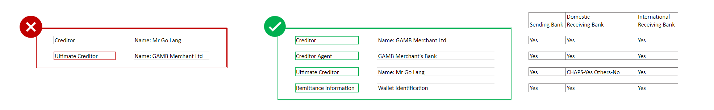
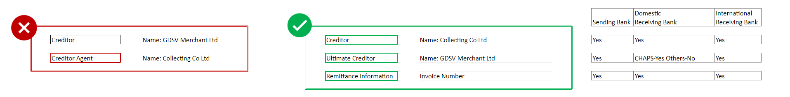
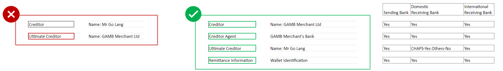
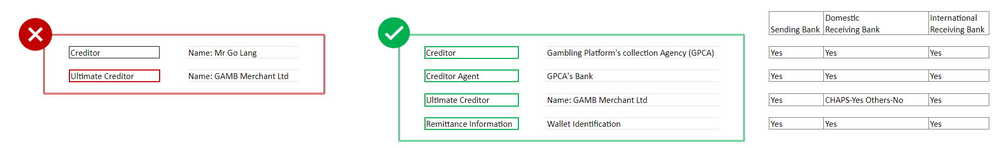
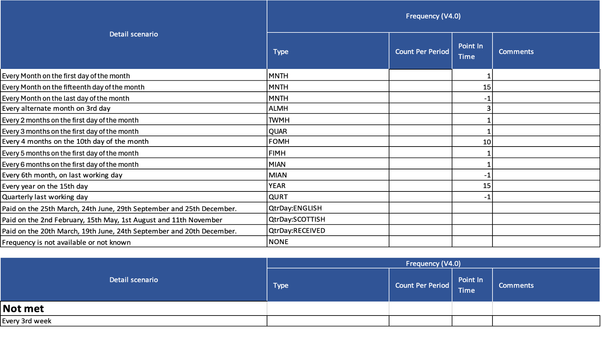

# Read-Write API Specifications
[[toc]]

### **What is the Read/Write API Specification?**

The Read/Write API specification describes a collection of RESTful APIs that enable authorised TPPs to access online payment accounts held at ASPSPs, securely, efficiently and with customer consent.

### **Where can I find the latest version of API specifications?**

Please see <a href="https://openbankinguk.github.io/read-write-api-site3/" class="external-link" rel="nofollow">Read Write API Specifications</a>

### **Where can I find the timings for Implementing Open Banking Roadmap?**

The timings are defined in the Open Banking Roadmap.

[2018-2019 - Open-Banking-Revised-Roadmap-July-2018](https://www.openbanking.org.uk/wp-content/uploads/Open-Banking-Revised-Roadmap-July-2018.pdf)

[2020 - 2021 - Notice of approval of changes to the Agreed Timetable and Project Plan - May 2020](https://assets.publishing.service.gov.uk/government/uploads/system/uploads/attachment_data/file/885537/Notice_of_proposed_changes_to_the_open_banking_roadmap_-_web_publication_-_cma_gov_uk_---_May_2020_-.pdf)

These implementation timings apply to the CMA9, as required by the CMA Order. 

### **Are there any known issues in the latest version of Specifications?**

Yes, there are and it is recommended to read the specifications in conjunction with the
<a href="https://openbanking.atlassian.net/wiki/spaces/DZ/pages/47546479/Known+Specification+Issues/" class="external-link" rel="nofollow">Known Specification Issues</a>

### **Where can I find the latest version of Swagger Specifications?**

The Swagger Specification for Read/Write APIs can be downloaded from the following GitHub Repository:

<a style="text-decoration: none;" href="https://github.com/OpenBankingUK/read-write-api-specs" class="external-link" rel="nofollow">https://github.com/OpenBankingUK/read-write-api-specs</a>

### **What APIs can an AISP access?**

The Account and Transaction API Profile describes the flows and common functionality for the Accounts and Transaction API, which allows an Account Information Service Provider ('AISP') to:

* Register an intent to retrieve account information by creating an "account access consent". This registers the data "permissions", expiration and historical period allowed for transactions/statements - that the customer (PSU) has consented to provide to the AISP; and

* Subsequently, retrieve account and transaction data.

The links to the list of Account and Transaction APIs :
<a href="https://openbankinguk.github.io/read-write-api-site3/v4.0/profiles/account-and-transaction-api-profile.html" class="external-link" rel="nofollow">Account and Transaction APIs</a>

### **What APIs can an CBPII access?**

The Confirmation of Funds API Profile describes the flows and common functionality for the Confirmation of Funds API, which allows a Card Based Payment Instrument Issuer ('CBPII') to:

* Register an intent to confirm funds by creating a "funds confirmation consent" resource with an ASPSP, for agreement between the PSU and ASPSP. This consent is a long lived consent, and contains the length of time (expiration date) the customer (PSU) would like to provide to the CBPII; and
* Subsequently, make a request to confirm funds are available.
* Funds can only be confirmed against the currency of the account.

This profile should be read in conjunction with a compatible Read/Write Data API Profile which provides a description of the elements that are common across all the Read/Write Data APIs, and compatible individual resources.

For more details refer to :
<a href="https://openbankinguk.github.io/read-write-api-site3/v4.0/profiles/confirmation-of-funds-api-profile" class="external-link" rel="nofollow">Account &amp; Confirmation of Funds API Profile</a>

### **How can the ASPSP inform the AISP that access has been revoked?**

The OB solution supports the revocation of consent at the TPP dashboard and the revocation of access at the ASPSP dashboard.

When access is revoked at the ASPSP access dashboard by the PSU, the TPP can be notified as follows:-

* Real-time/ Push Notifications: The functionality enables ASPSPs to notify AISPs in real-time (i.e. immediately) when a PSU revokes their access at their ASPSP dashboard or other account access changes events take place.
* Aggregated polling / Pull Notifications: This enables the provision of notification of revocations from ASPSPs to AISPs, upon AISP request. It allows an AISP to request an aggregated set of access revocations and other account access events related to multiple access consents from multiple PSUs during a specific period.

For more details refer to: [customer-experience-guidelines - Dashboards - Notifications](https://standards.openbanking.org.uk/customer-experience-guidelines/dashboards/psu-notifications/latest/#psu_notif_sync/)

### **What APIs can an PISP access?**

The Payment Initiation API Profile describes the flows and common functionality for the Payment Initiation API, which allows a Payment Initiation Service Provider ('PISP') to:

* Register an intent to **stage** a payment-order consent.

* Optionally confirm available funds for a payment-order (domestic immediate, international immediate and international scheduled (immediate debit) payments only.

* Subsequently **submit** the payment-order for processing.

* Optionally retrieve the status of a payment-order **consent** or payment-order **resource** .

For more details refer to :
<a href="https://openbankinguk.github.io/read-write-api-site3/v4.0/profiles/payment-initiation-api-profile.html" class="external-link" rel="nofollow">Payment Initiation API Profile</a>

### **Which payment-order types are supported by the PIS API?**

* Domestic payments.
* Domestic scheduled payments.
* Domestic standing orders.
* International payments.
* International scheduled payments.

### **Are there different signing policies for Event Notifications?**

The signing policy for any resource isn't dependent on the Swagger File. It is up to the ASPSP's implementation of the Events resource, e.g. <a href="https://openbankinguk.github.io/read-write-api-site3/v4.0/profiles/event-notification-api-profile.html#event-notification-message-signing" class="external-link" rel="nofollow">Event Notification Message Signing</a> and is similar to any other Read/Write API specification, other than the JWT's signature (JWS) which is sent in the HTTP body of the request, as opposed to a detached JWS sent in the HTTP header.

### **What is the Event Notification API?**

The Event Notification API Profile describes the flows and common functionality to allow a TPP to receive event notifications.

This covers a number of use cases, including:

* Updates to the status of a payment initiation (e.g. when there are multiple authorisations required in the ASPSP interface).
* Revocation of AISP access by the PSU in the ASPSP interface.

For more details refer to :
<a href="https://openbankinguk.github.io/read-write-api-site3/v4.0/profiles/event-notification-api-profile" class="external-link" rel="nofollow">event-notification-api-profile</a>

### **How can a TPP register with the ASPSP to receive event notifications?**

The  <a href="https://openbankinguk.github.io/read-write-api-site3/v4.0/profiles/event-notification-subscription-api-profile.html" class="external-link" rel="nofollow">Event Notification Subscription API Profile</a> and the  <a href="https://openbankinguk.github.io/read-write-api-site3/v4.0/profiles/callback-url-api-profile.html" class="external-link" rel="nofollow">Callback URL API Profile</a> provide alternative mechanisms for TPPs to register for event notifications.
* The Event Notification Subscription API allows TPPs to register to receive all or specific event types via the Real-Time Event Notification API and/or the Aggregated Polling API
* The Callback URL API allows TPPs to register to receive `aurn:uk:org:openbanking:events:resource-updateevent` notification via the Real-Time Event Notification API.

### **Are there separate swagger specifications for Real-time (push) notifications and aggregated polling?**

Event Subscription, CallbackURLregistration and Aggregated Polling specifications are all hosted by the ASPSP, while the TPP hosts the endpoint to receive real-time push notifications.

There are two Swagger specification files, for Events Resources:

* [event-subscriptions-openapi & aggregated-polling-openapi](https://github.com/OpenBankingUK/read-write-api-specs/blob/v4.0/dist/openapi/events-openapi.yaml)
* [event-notifications-openapi](https://github.com/OpenBankingUK/read-write-api-specs/blob/v4.0/dist/openapi/event-notifications-openapi.yaml)
* 
### **How should my redirect URIs be encoded?**

Both ASPSPs and TPPs should format all URIs using URL encoding. Participants should accept all URLs which have been URL encoded. (see [here](https://www.w3schools.com/tags/ref_urlencode.asp)).

### **What length of URIs should be allowed for redirect**

OBL does not define a maximum URI length.

The URI limit is something that is enforced by your server and client. It is reasonable to assume URIs could be as much as 2048 characters, which is the lowest limit of any of the major, modern browsers.

Participants should be able to handle the URIs of unbounded length if they provide GET-based forms that could generate such URIs. In the event where the TPP has exceeded the maximum supported length, the ASPSP must return a 414 (Request-URI Too Long).

### **What do we refer to as mandatory GET endpoints?**

The GET endpoint enables the PISP to check the status of the payment consent resource.

The GET endpoints listed below are considered mandatory for implementation. This would be applicable irrespective of whether the response in both POST and the GET remains the same.

* GET /domestic-scheduled-payments/{DomesticScheduledPaymentId}
* GET /domestic-standing-orders/{DomesticStandingOrderId}
* GET /international-scheduled-payments/{InternationalScheduledPayment}
* GET /international-standing-orders/{InternationalStandingOrderPaymentId}

### **How can ASPSPs provide relevant charges to a PISP?**

The Open Banking Write specification enables the ASPSP to provide any relevant charges related to the payment order to the PISP in two ways:-

(a) When the PISP sets up the payment order, the ASPSP can populate relevant charges (including a breakdown) as part of the payment consent response (name of response which is returned to the PISP.

(b) When the PISP submits the payment order, the ASPSP can respond by including any relevant charges (including a breakdown) as part of the payment response, which is returned to the PISP.

For more details refer to : [api-specifications/read-write-specs/latest/](https://openbankinguk.github.io/read-write-api-site3/v4.0/profiles/read-write-data-api-profile.html)
<a href="https://openbankinguk.github.io/read-write-api-site3/v4.0/resources-and-data-models/pisp/domestic-payments.html">Domestic Payments v4.0</a>
* Domestic payment consent - response (xpath - OBWriteDomesticConsentResponse5/Data/Charges).
* Domestic payment - response (xpath - OBWriteDomesticResponse5/Data/Charges).

<a href="https://openbankinguk.github.io/read-write-api-site3/v4.0/resources-and-data-models/pisp/international-payment-consents.html">International Payments v4.0</a>
* International payment consent - response (xpath - OBWriteInternationalConsentResponse6/Data/Charges).
* International payment - response (xpath - OBWriteInternationalResponse5/Data/Charges).

### **Can a PISP display an ASPSP's charges to the PSU?**

The PISP could display any relevant ASPSP charges related to the payment order during the consent stage of their journey, however, this will be dependent on whether the ASPSP has shared these charges with the PISP as part of the payment consent response.

### **Can an ASPSP display their charges to the PSU during authentication?**

Yes, the ASPSP can provide any supplementary information related to the payment, like charges (if applicable) to the PSU as part of their authentication journey.

Please refer to the following example journeys in CEG:

* <a href="https://standards.openbanking.org.uk/customer-experience-guidelines/payment-initiation-services/international-payments/latest/">International Payment Journey</a> - CEG Checklist #9.
* <a href="https://standards.openbanking.org.uk/customer-experience-guidelines/payment-initiation-services/single-domestic-payments-supplementary-information/latest/">Domestic Payments - a/c selection @PISP (Supplementary Info)</a> - Additional Information.

### **What if a PISP does not provide the optional 'ChargeBearer' field?**

If the PISP does not provide a charge bearer value in the payment consent request payload, and if this cannot be determined (e.g. in case of SEPA payment) then the ASPSP should not reject the payment, but it should seek to get this information from the PSU via the supplementary information screen as part of authentication journey.

### **Which ChargeTypes would be used for a SEPA Credit Transfer or SWIFT payment?**

Within the specified OBExternalPaymentChargeType1Code enum, the namespaced enumeration for charge types is not intended to be exhaustive, and ASPSPs can add their own enumerations.

### **Can an ASPSP provide statements to an AISPs in non-JSON file format?**

Yes, an ASPSP can provide a statement to the AISP using non JSON file format. The link to access this statement using a non JSON file format:

<a href="https://openbankinguk.github.io/read-write-api-site3/v4.0/resources-and-data-models/aisp/Statements.html#get-accounts-accountid-statements-statementid-file/" class="external-link" rel="nofollow">GET /accounts/{AccountId}/statements/{StatementId}/file
</a>

### **What are the implementation timelines for a newly published specification or guidelines?**

Please refer to the Operational Guidelines: <a href="https://standards.openbanking.org.uk/operational-guidelines/change-and-communication-management/implementation-of-a-new-obl-standard/latest/" class="external-link" rel="nofollow">Implementation of a new Open Banking Standard</a>

* It is up to ASPSPs to take their own position of which version of each component of the Standard they chose to implement in order to meet both regulatory and commercial requirements.
* OBL recommends that where an ASPSP chooses to implement a new version of any component of the Standard, they should implement each new major version within six months, and each new minor version within three months of the Standard being published by OBL.

ASPSPs should provide notification of any changes to TPPs at least three months prior to those changes taking effect.

### **Do TPPs have to implement the s Dashboard?**

While there is no regulatory requirement for the provision of a consent dashboard by TPPs, OBL strongly encourages all TPPs to provide a consent dashboard to their customers to enable view and revoke on-going consents.

### **Is OBErrorResponse1/Errors/Message mandatory, and what level of detail is expected?**

This is considered a mandatory field and ASPSPs must include a description of the error that occurred. E.g., 'A mandatory field isn't supplied' or 'RequestedExecutionDateTime must be in future'

OBL does not standardise this field and it is up to each ASPSP to determine the appropriate level of detail to provide an adequate description of the error that has taken place to the TPP.

TPPs will need to determine which error codes to implement depending on the relevant error code(s) applicable to them and their service offerings.

### **When should ASPSPs mark 'payment consent resource' as 'Rejected'?**

The ASPSP must mark the consent as 'Rejected' when the PSU does not complete the consent-authorisation flow.

The ASPSP must also set the status of the payment-order consent to Rejected, if the AuthorisationType requested by the PISP cannot be satisfied, after PSU Authentication. The ASPSP must respond back with an OAuth error response fields error specified as invalid_request and ***error_description*** containing an appropriate message.

### **When should ASPSPs reject a Payment-Order?**

An ASPSP must reject an authorization request when the underlying intent object is associated with a CutoffDateTime that has elapsed. The ASPSP must not issue an access token in such a situation. The ASPSP must set the status of the payment-order consent resource to “Rejected”.

### **Can AISPs change the permission language?**

The AISP must ensure they have business rules that manage the relationship between data clusters and product type. They must omit access to data clusters that are irrelevant to a product type, as well as their service offering. If an AISP requests a cluster of data that is irrelevant to the product type associated with the payment account e.g. Direct Debit cluster requested for a Savings Account product type, the ASPSP may provide that cluster as empty.

For more guidance, refer to [customer-experience-guidelines/account-information-services/permissions-and-data-clusters/latest/](https://standards.openbanking.org.uk/customer-experience-guidelines/account-information-services/permissions-and-data-clusters/latest/)

### **Is it mandatory to implement refresh_token-expires_at?**

If the ASPSP issues a refresh token that expires, the ASPSP must indicate the date-time at which the refresh token will expire in a claim named `http://openbanking.org.uk/refresh_token_expires_at` in the Id token (returned by the token end-point or userinfo end-point). Its value MUST be a number containing a NumericDate value, as specified in `https://tools.ietf.org/html/rfc7519#section-2`
* NumericDate is a JSON numeric value representing the number of seconds from 1970-01-01T00:00:00Z UTC until the specified UTC date-time, ignoring leap seconds.

If the ASPSP does not issue a refresh token, the ASPSP **must not** populate the `http://openbanking.org.uk/refresh_token_expires_at` claim in the Id token

If the ASPSP issues a refresh token that does not expire, the ASPSP **must not** populate the claim named `http://openbanking.org.uk/refresh_token_expires_at` in the Id token.

For more details refer to: [read-write-data-api-profile.html#token-expiry-time](https://openbankinguk.github.io/read-write-api-site3/v4.0/profiles/read-write-data-api-profile.html#token-expiry-time)

### **Does an ASPSP need to delete Client related consents once TPP has deleted Client?**

This relates to client registration that the TPP does with each ASPSP.

The OBL Standard is silent on Client registration and De-registration. It is up to ASPSPs to decide their approach in alignment with FAPI and OpenId Connect.

### **Is it possible to amend or revoke a standing order (SO) or scheduled payment (FDP)?**

If a PSU has given consent to a PISP to initiate a SO or FDP, then the SO and FDP cannot be amended or cancelled via a PISP directly following payment initiation. However, it is expected that customers should be able to amend or cancel a SO or FDP in the domain of their ASPSP, provided that this functionality is available in the direct online channels.

### **What types and lengths of account identification are supported?**

UK.OBIE.SortCodeAccountNumber is specific to UK. The SchemeName field is namespaced, meaning the ASPSP/PISP may use a different scheme name, if it is not already defined in OBL specifications.

The identification field is 256 characters long so you can add more than 14 characters if required.

### **Does the ASPSP always have to redirect back to the TPP?**

The OBL Standard supports 2 methods of authentication: redirection and decoupled.

For redirection, OBL's research has suggested that redirection screens are a useful part of the process, providing customer trust. The following reasons are noted:

They help customers navigate their online journey and inform them of what is going to happen next.
They help create a clear sense of separation between the TPP’s domain and the ASPSP’s domain.
For more details, please refer to Customer Experience Guidelines:

  * <a href="https://standards.openbanking.org.uk/customer-experience-guidelines/authentication-methods/latest/#Redirection_based/" class="external-link" rel="nofollow">Redirection based authentication</a>

* <a href="https://standards.openbanking.org.uk/customer-experience-guidelines/authentication-methods/redirection/section-b/latest#Effective-use-redirection-screens" class="external-link" rel="nofollow">Effective use of redirection screens</a>

### **What message should an ASPSP return when a TPP requests permissions to an endpoint that is not implemented?**

The standards do not specify the response in this situation. ASPSPs may:

* reject the account-access-consent with a status code of 400 and error code of `UK.OBIE.Field.Invalid` OR
* process the request successfully.

ASPSPs **must** make documentation available to TPPs (e.g. on their developer portals) which should specify which 'Conditional' / 'Optional' endpoints and fields have been implemented.

### **When a TPP calls the Party or Parties endpoint, will they always receive the PartyType attribute?**

It is optional for the ASPSPs to provide the PartyType field as part of the Party or Parties endpoint.

ASPSPs **must** make documentation available to TPPs (e.g. on their developer portals) which should specify which 'Conditional' / 'Optional' endpoints and fields have been implemented.

### **Is there a list of all ASPSPs participating in the Open Banking Ecosystem?**

Together with UK Finance and FDATA, OBL has developed and maintains a list of ASPSPs here: <a href="https://openbanking.atlassian.net/wiki/spaces/AD/pages/1135346433/Transparency+Calendar/" class="external-link" rel="nofollow">Transparency Calendar</a>

This shows key information including: contact details, which directory is being used, and a link to a page maintained by each ASPSP showing further details of the APIs being implemented by each. While this list does not guarantee to include all UK ASPSPs, it is intended to be as comprehensive as possible.

### **What error code should an ASPSP send back to a TPP if a wrong x-fapi-financial-id was sent in the request?**

The `x-fapi-financial-id` header was required up until Version 3.1.1 of the OBL Read-write API profile. ASPSPs that implement this version must reject an invalid request with a 403 (Forbidden).

The requirement for providing `x-fapi-financial-id` in the request header was removed from FAPI and subsequently removed from Version 3.1.2 of the Read/Write API Specification.

### **Are File Payments supported in the Standard for both personal and business accounts?**

File Payments allow a file of payment requests to be uploaded to an ASPSP for payment initiation. Implementation of this endpoint is 'Conditional' which means the ASPSP must implement if the same functionality is supported for their PSUs (which could be for Business and/or Personal accounts) on their existing online channels.

### **How can we know if an ASPSP supports File Payment endpoint?**

ASPSPs must make documentation available to TPPs (e.g. on their developer portals) to which 'Conditional' / 'Optional' endpoints and fields are implemented for any given implementation of the specification.

### **Can ASPSPs create their own enumeration when required?**

Yes, ASPSPs can create their own enumerations.

The OBL Specification includes various fields of Enumerated data types, where either the values are fixed to an OBL defined set of alternatives (i.e. Static Enumerations), or flexible with an initial OBL defined set of alternatives, and ASPSPs can use/extend these alternatives (i.e. Namespaced Enumerations).

See : [namespaced-enumerations](https://openbankinguk.github.io/read-write-api-site3/v4.0/references/namespaced-enumerations.html)

### **Have any ASPSPs requested new values to be added to enumeration?**

ASPSPs do not need to approach OBL before adding new enumerated values. They are free to do so, when necessary.

### **Does an AISP need to display OBL defined data clusters and permission language in the UI?**

While not a specific regulatory requirement, AISPs are strongly encouraged to clearly display the OBL data clusters and permission language to the PSU as part of their consent journey.

### **How can the ASPSP inform the AISP that access has been revoked?**

The OB solution supports the revocation of consent at the TPP dashboard and the revocation of access at the ASPSP dashboard.
When access is revoked at the ASPSP access dashboard by the PSU, the TPP can be notified as follows:-
* Real-time/ Push Notifications: The functionality enables ASPSPs to notify AISPs in real-time (i.e. immediately) when a PSU revokes their access at their ASPSP dashboard or other account access changes events take place.
* Aggregated polling / Pull Notifications: This enables the provision of notification of revocations from ASPSPs to AISPs, upon AISP request. It allows an AISP to request an aggregated set of access revocations and other account access events related to multiple access consents from multiple PSUs during a specific period.

For more details refer to :
<a href="https://standards.openbanking.org.uk/customer-experience-guidelines/dashboards/psu-notifications/latest/" class="external-link" rel="nofollow">Customer Experience Guidelines - PSU notifications</a>

### **What Resource URI Path Structure should be used while implementing the Read Write API Specification v4.0?**

If implementing Version 4.0, the major version is 4 and the minor version is 0. Patch release must not be present in the URI path. In this case, the implementer must define the resource URI path as 4.0.

### **What is the correct way of creating and passing ConsentId?**

The PISP **must** begin a payment-order request by creating a **payment-order consent** resource through a **POST** operation. This will confirm the parameters of the consent agreed between the PSU and the PISP.  At this stage, the consent is considered "staged" as the PSU would need to authenticate with their ASPSP. The ASPSP responds with a ConsentId. This is the intent-id used when initiating the authorisation code grant.

### **What error should be returned if an account is in derogatory status (e.g. Fraud Stop)?**

It is up to each ASPSP to decide whether to send a 403 or a 200 with an empty response, in consideration to relevant regulatory obligations e.g AML, where applicable.

### **Can a PISP create consent in a previous version and a payment order resources in a newer version?**

A PISP **must not** create a payment-order consent ConsentId on a previous version and use it to create a payment-order resource in a newer version.

* E.g., A PaymentId created in v1, must not be used to create a v3 DomesticPaymentId.

### **Can a PISP create consent in a new version and a payment order resource using an older version?**

A PISP **must not** create a payment-order consent ConsentId on a newer version and use it to create a payment-order resource in a previous version.

* E.g., A ConsentId created in v3, must not be used to create a v1 PaymentSubmissionId.

### **Which error codes should be used when a TPP submits incorrect JSON (e.g. extra quotes, invalid date and time, etc)?**

The ASPSP should respond with 400 (Bad Request) and the relevant Namespaced Enumeration.

Please see [incomplete-or-malformed-request-payload](https://openbankinguk.github.io/read-write-api-site3/v4.0/profiles/read-write-data-api-profile.html#incomplete-or-malformed-request-payload) and [namespaced-enumerations](https://openbankinguk.github.io/read-write-api-site3/v4.0/references/namespaced-enumerations.html)

### **Does a TPP need to return id_token_signed_response_alg if they only support code as response type?**

No. The TPP need to return `id_token_signed_response_alg` only when the response type is `code id_token`. This is the algorithm that the TPP expects to sign the id_token if an id_token is returned.

### **What are the different types of charge bearer codes supported in single immediate (domestic) payment?**

The different types of charge bearers supported are:-

* BorneByCreditor

* BorneByDebtor

* FollowingServiceLevel

* Shared

See: [Static enumerations](https://openbankinguk.github.io/read-write-api-site3/v4.0/profiles/payment-initiation-api-profile.html#static-enumerations)

### **In the Transaction API, is the transaction amount field inclusive/exclusive of ChargeAmount?**

The standard is silent on whether the amount is inclusive or exclusive of the charge. As a result, we cannot provide any specific direction on how these values should be computed.

However, you should take the following into account:

1. A charge is not always borne by the customer - it could be borne by the other party (or even shared). Some business accounts could be set up so that all charges are borne by a “charges account” that is separate.

2. The transaction history for the account returned by the APIs must be complete in and by itself. This means that if a separate charge line does not appear in the transactions, it can be safely assumed that the Amount includes the charge borne by the account holder. This could be any value from zero to the charge amount due to shared charging situations.

3. If the charge is not included in the transaction line itself, it must appear as a separate line where it is non-zero.

### **Does an ASPSP need to support all variants of DateTime format as per ISO 8601?**

An ASPSP must accept all valid <a href="https://www.iso.org/iso-8601-date-and-time-format.html date" class="external-link" rel="nofollow">ISO-8601 - Date and time format</a> formats including its permitted variations (e.g. variations in how the time zone is defined, dates with or with a seconds or milliseconds part etc.) in API requests from TPPs. 

### **What if an ASPSP is not able to support functionality or an attribute in the payload. Should the ASPSP reject the request from the TPP?**

When an ASPSP receives a payment order that they cannot process (and it is in parity with their online channels), the ASPSP could reject such a payment order. ASPSPs must make documentation available to TPPs (e.g. on their developer portals) which should specify which 'Conditional' / 'Optional' endpoints and fields have been implemented.

Examples include: 

1. setting up a standing order with a frequency that they do not support,
2. making a Forex payment with a currency they do not support or indeed, and
3. specifying a date-time that is not supported.

### **How many days of transactions are allowed for credit card transactions in the transactions API aligning to the regulation?**

It is up to each ASPSP to be at parity with their online channels and also seek their own legal guidance.

### **In the event subscription API, should the single event subscription be the Organisation ID or Software ID?**

This should be the ClientID.

### **Should the 'offers' resource be used only for the specific account (e.g. Credit Card Limit Increases) as opposed to all possible offers a customer could see online (e.g. a pre-approved loan offer based on their credit card payment history and credit file)?**

The offers end-point arose from the interpretation that the API interface should make available whatever information is available to the PSU in the online channel.

It is up to each ASPSP to determine what information needs to be made available through these end-points, based on individual regulatory considerations. 

The standard specifically provides for two endpoints - a “bulk” endpoint and an account-specific endpoint for offers.

### **Should the offers endpoint be for the specific account or all possible offers a customer could see online?**

The offers endpoint is used by an AISP to retrieve the offers available for a specific AccountId or to retrieve the offers detail in bulk for all accounts that the PSU has consented to. It is up to each ASPSPs to determine  what information needs to be made available through these end-points, based on individual regulatory considerations. 

### **For message signing, what should be the input payload for the signature (e.g. HTTP body, parsed JSON, canonicalised JSON etc)?**

The standard states
The HTTP body would form an un-encoded payload as defined in <a href="https://tools.ietf.org/html/rfc7797" class="external-link" rel="nofollow">RFG 7797</a>

The only workable option is to use a buffer or character array that represents the HTTP body.

### **Should the trust anchor in detached JWS Signatures in Sandbox be openbanking.org.uk or openbankingtest.org.uk?**

The standard only specifies the trust anchor value to be used in production scenarios when using the OBL Directory. The value openbanking.org.uk should be used to identify the OBL Directory as the trust anchor.

The standard does not specify the trust anchor value to be used when the OBL Sandbox Directory is used as a trust anchor.

The model bank that is commissioned by the OBL will accept either openbanking.org.uk or openbankingtest.org.uk as tan values.

### **Why does the OBL standard not use standard security headers such as Content-Security-Policy, X-XSS-Protection etc ? Can an ASPSP add these headers to their responses?**

The APIs are not meant to be surfaced up in a browser directly and it does not make sense to include those headers in the context of these standards.

ASPSPs may add additional headers in their responses. The standard does not prohibit this behaviour. The TPP may ignore such headers.

On the other hand, if the ASPSPs expect a specific header to be set by TPPs in the request, that would be possibly non-compliant behaviour.

### **In the context of AIS, is it possible to have a longer-lived token over 90 days if only the balance is read?**

Currently, under PSD2/RTS, SCA needs to be performed at least every 90 days by the ASPSP. This means that even if only balance is being accessed, SCA will need to be performed if more than 90 days have passed since the last SCA was applied by the ASPSP. 

### **In the context of PIS, does the consent for payment expire if not used? Can the token expiry be set to 90 days and the token refreshed if not expired?**

Payment-consents tokens are meant to be “short-lived” and should be expected to last for a few minutes at most. The RTS Art. 10 exemption which supports the 90-day access token functionality applies to AIS only. 

### **How long are transactions available via the transactions API after the bank account is closed?**

This will be dependant on whether and to what extent this information is available to the PSU in the direct channels. This will be up to each ASPSP to determine based on relevant regulatory obligations.

### **Can you give a few examples to illustrate the use of `InstructedAmount` for an International Payment?**

| Scenario                                                             | Debit Account denomination | Currency of Transfer | /InstructedAmount/Currency |
|----------------------------------------------------------------------|----------------------------|----------------------|----------------------------|
| Instruction that creditor should receive 100 EUR                     | GBP                        | EUR                  | EUR                        |
| Instruction that creditor should receive EUR equivalent of 100 GBP   | GBP                        | EUR                  | GBP                        |
| Transfer 100 GBP to GBP denominated account held in another country. | GBP                        | GBP                  | GBP                        |

### **Which error codes should the ASPSP use while responding back to the TPP in case of an error?**

The ASPSP should send the appropriate response depending on which spec applies to the end-point that is being called.

For eg: When there is an error in relation to a token endpoint which is defined in OIDC and OAuth2, the error responses should comply with the OAuth2 / OIDC format.

### **Is it acceptable for an ASPSP to issue 302 redirects during the authorization code grant flow to the PSU’s user agent?**

OpenID Connect, OAuth2 and FAPI do not define the behaviour of the AS between the time that the authorization code grant has started and its end (signalled by a redirect to the TPP in most cases)

For the journey to be a “compliant” OIDC/OAuth2 journey, there are a number of boxes to tick:

1. The TPP constructs the authorization URL and issues it to the PSU’s browser. The URL should contain query parameters and request objects that are OIDC compliant. The URL should be the authorization_server in the ASPSP’s .well-known. The `redirect_uri` parameter should be the TPP’s registered URI.

2. Once the PSU’s browser follows the redirect, the flow can be pretty much whatever the ASPSP wants to implement. The CEGs provide some standards on what those journeys should look like, but no technical constraints on redirects etc that take place.

3. That journey MUST end with the PSU browser receiving a 30x Redirect response. The redirect must be to the redirect_uri in the query parameter in #1 above. This URL must have OIDC/OAuth2 format query or hashbang parameters (e.g. code, error, error_description, nonce(?) etc

Practically, some browsers will cause issues with a TOO_MANY_REDIRECTS error - but the standard is silent on that.

### **What does each of the Balance types mean? Does an ASPSP have to provide specific balance types in its response?**

The enumeration for the Balance Type field is based on the ISO 20022 definition for the field. When we base data structures on an underlying standard, we do not generally provide additional descriptions on the usage, unless there is an OBL specific deviation.

The ASPSPs are free to determine which balance types they should publish. The general expectation is that an ASPSP should provide the same information through its APIs as it does through its online channels. In situations where the more than one Balance Type could be used to describe the balance provided by the ASPSP, it is for the ASPSP to determine the appropriate type to be used.

#### **As an ASPSP, do we need to support a specific file type for File Payments?**

ASPSPs need to provide the ability for PISPs to initiate the same payment types, which can be initiated by the PSU on their online channels. The ASPSPs can define their own [namespaced enumeration](https://openbankinguk.github.io/read-write-api-site3/v4.0-draft1/profiles/read-write-data-api-profile.html#enumerations) to list their custom file types.

#### **As a TPP, do we need to support a specific file type for File Payments at an ASPSP?**

Each ASPSPs will have their own existing legacy and proprietary file formats which enables the PSU to upload on the ASPSPs existing channels. The same should be made available via PISP.

#### **Can you explain what is included in `InterimAvailable` balance type for credit cards?**

As per ISO definition, `Available balance calculated in the course of the account servicer's business day, at the time specified, and subject to further changes during the business day. The interim balance is calculated on the basis of booked credit and debit items during the calculation time/period specified.`

For e.g.: A credit card that has 30 GBP worth of transactions and a 100 GBP credit limit.

`InterimBooked` balance would be 30 GBP Dr.

`InterimAvailable` balance would be 70 GBP Cr (with a CreditLine.included = true and value of 100 GBP).

We would suggest you refer to https://www.iso20022.org/standardsrepository/type/BalanceType10Code for more definitions on the different balance types.

#### **When a payment is refunded, what should be the captured in the `Creditor` and `Agent` fields of the `Refund` block?**

The `Refund` block must contain the refund account details of the party being refunded.

For eg: If Mr X has made a purchase using ASPSP1 Bank and needs to be refunded then,

Refund.Creditor = Mr X.

Refund.Agent= ASPSP1 details.

Refund.Account= Mr X account details that were used to make the purchase originally.

#### **Are any of these attributes available for Credit Cards & Overdraft information?**

1. Interest Rates (APRs) for Credit Cards and Overdraft.

2. Balance subject to Purchase APR on credit cards. (so we can separate out balance transfers at 0%)

3. Bill Due Date for Credit Cards.

4. The minimum payment amount for Credit Cards.

The R/W specification enables ASPSPs to provide this information (as per the endpoints) outlined below, however, it is up to the individual ASPSP to determine whether to populate this based on their relevant regulatory considerations: 

1. Interest Rates (APRs) for Credit Cards and Overdraft-  Provided in `Products` endpoint.

2. Balance subject to Purchase APR on credit cards. (so we can separate out balance transfers at 0%) - `StatementInterest` on the `statements` end-point.

3. Bill Due Date for Credit Cards - `StatementDateTime` on `statements` end-point.

4. The minimum payment amount for Credit Cards - `StatementAmount` on `statements` endpoint.

### **How do we know whether ASPSP supports PAIN file format for file/bulk payments?**

ASPSPs are expected to make documentation available of the file formats & fields they support on their developer portals for the TPPs for any given implementation of the specification.

It is not considered mandatory for ASPSPs to implement this format.

### **What would be the appropriate `ErrorCode` in case the request contains a malformed body, e.g. incorrect JSON?**

The closest would be `UK.OBIE.Field.Invalid` 

If the JSON could be parsed, but some fields could not be validated, the error message should include the field (or if possible, fields) that were invalid.

### **For the hybrid/authorization code grant, can you please provide a more complete list of the scenarios in which an ASPSP should not redirect back to the TPP, but should display an error page instead ?**

The question arises from the following statement in the CEG:

>The authorisation request may be malformed when submitted by the TPP. For >example, it may include an invalid redirection URL, invalid parameters, invalid signature on the request object etc. OAuth2 and OIDC define a whole list of potential errors. These are abnormal situations which indicate a significant technical issue at the TPP’s end or even an attacker trying to act as a TPP. For safety (and as per the standards) the ASPSP must not redirect the PSU back to the TPP in such situations. The ASPSP must display an error message and stop the execution at this point. It is at the ASPSPs’ discretion to display to the PSU the message they find most appropriate for this error case, however an error message must be displayed. In this situation, TPPs do not receive a response back from the ASPSPs about the malformed authorisation request. Therefore, TPPs are not able to display any message to the PSU in this situation.

We would like to clarify that the CEG does not suggest that ASPSPs implement behaviour that is contrary to OAuth2, OIDC or FAPI.

At the core of this requirement, is the statement in OAuth2 - https://tools.ietf.org/html/rfc6749#section-4.1.2.1

>If the request fails due to a missing, invalid, or mismatching redirection URI, or if the client identifier is missing or invalid,  the authorization server SHOULD inform the resource owner of the error and MUST NOT automatically redirect the user-agent to the invalid redirection URI.

In addition to that, ASPSPs may rely on OAuth Security BCP, https://tools.ietf.org/html/draft-ietf-oauth-security-topics-15#section-4.9.2 :

>Based on its risk assessment, the ASPSP  needs to decide whether it can trust the redirect URI and SHOULD only automatically redirect the user agent if it trusts the redirect URI. If the URI is not trusted, the AS MAY inform the user and rely on the user to make the correct decision.

Each ASPSP must reach its own reasoned decision. It may consider, for example, whether a missing, malformed or incorrectly signed request should be considered as a risky request.

### **Can the ASPSPs implement rate-limiting?**

While rate-limiting is supported by the specifications, ASPSPs will need to consider the factors below in line with relevant regulatory consideration when making a decision on an appropriate limit:

* rate limiting is conducted in a manner that reasonable, non-discriminatory and not an obstacle to the TPPs.

* provides at least the same level of availability/performance as existing PSU interfaces.

* do not apply any measures to induce TPPs to adopt a new version of the APIs where rate limit is applied to an older version and better performance is provided on a newer version.

ASPSPs must make documentation available to TPPs (e.g. on their developer portals) and clearly publish rate limits for each version.

ASPSPs should respond with `429 - Too many requests` status code if they rate limit requests from TPPs (as specified here - https://openbankinguk.github.io/read-write-api-site3/v3.1.6/profiles/read-write-data-api-profile.html#http-status-codes)

### **What is the expected response when an AISP tries to access AIS endpoints for a closed or switched account?**

The standards define the behaviour that is expected <a href="https://openbankinguk.github.io/read-write-api-site3/v4.0/profiles/read-write-data-api-profile.html#_400-bad-request-v-s-404-not-found" class="external-link" rel="nofollow">here</a>.

From Version 3.1.6, the ASPSPs may also return a flag to indicate the account’s switch status as part of the response to the accounts end-point.

If a PSU has consented to multiple accounts and then closes one or more, but not all of the accounts in the consent, the ASPSP should allow continued access to the remaining accounts.

### **As an ASPSP can we revoke access to TPPs following an account switch/closure? Does this conflict with the requirement of v3.1.6 to provide CASS status back to TPP?**

It is up to each ASPSP to determine a suitable approach in relation to how to treat active AISP access to a closed account, taking into consideration the applicable regulatory requirements.  They should be viewed as separate to the requirement to provide a CASS status message back to the AISP.  

### **What should be the ASPSPs response, when the AIS tries to access a PSU’s account that is switched out to another ASPSP and the ASPSP is not able to provide the switching status as it may not be available?**

In this instance, it is recommended that ASPSPs consider the creation of their own namespaced enumeration and return that.

### **Should `AccountId` be unique and immutable?**

Yes, `AccountId` is a unique and immutable identifier used to identify the account resource.

The value should be immutable across time - not just immutable for a given consent.

### **How many months/years backdated should transaction history be provided via AISP by the ASPSP?**

This should be the same period/length of time for which the information is available to the PSU when accessing their payment account in the direct channels.

### **What is the Ultimate Creditor in Payments?**

Ultimate Creditor is the beneficiary that is the ultimate party who is going to receive the funds. 
Few examples
1. Payment is credited to a credit card collection account but the ultimate beneficiary is the customer whose credit card account is being paid.
2. Payment is credited to an account of a financial company but the ultimate beneficiary is the customer of the company
3. Payment is credited to e-wallet account of the Merchant or the PISP if holding a e-money licence but the ultimate beneficiary is another party.

### **Who should provide the Ultimate creditor? Is it the PISP or the PSU?**

The PISP must provide the Ultimate creditor in the payment chain when they know who the ultimate beneficiary is. 

### **What is the benefit to the ASPSP of receiving Ultimate Creditor in single immediate domestic payment when faster payment cannot accept it?**

The sending ASPSP do not have visibility of whom the payment is actually being made to, when the PISP or Merchant has that visibility.  Refer to example scenarios for more.

### **Can Ultimate creditor be used to capture other information related to the creditor?**

No. If only one party/person is being paid, only capture the Creditor and not duplicate it under both Creditor and UltimateCreditor.

It must not be used to capture duplicate information, product information, or alias names or creditor agent details

### **Can you provide an example of how and when to provide ultimate creditor in a payment journey?**

If Payment service provider is acting as a collection agency offering collection on behalf of services (COBO) for Credit card payment, Mortgage payment, Collection on behalf of Merchant etc., then capture the COBO details under Creditor and the account on behalf of whom the collection is made under ultimate creditor.

Example : Customer paying a Merchant in return of delivery of goods. PISP is providing COBO service to the Merchant. PISP receives funds under a (Collecting Co Ltd) which is then passed on to the Merchant (GDSV Merchant Ltd).

### **Can you provide an example of when the PSU is the beneficiary of funds via a wallet provided by the PISP or the Merchant?**

Scenario 1: If the beneficiary holds an account wallet with the service provider.

Example: PSU (Mr Go Lang) funding their own wallet account on Gambling platform (holding e-money license) they fall under the e-money regulation. A Gambling Service Provider Merchant (GAMB Merchant Ltd) who might be using a PISP to provide services and holding an account at GAMB Merchant’s Bank.

Scenario 2 : If the beneficiary holds a wallet with the Payment service provider.

Example: PSU (Mr Go Lang funding their own wallet account on a Gambling Platform (NOT holding e-money license and the ‘wallet’ would represent tokens for the usage of their 'gaming' services only). The Gambling Services Provider Merchant  (GAMB Merchant Ltd) uses PISP services as a collection agency funds from their clients.

### **What is the Ultimate Debtor in Payments?**

Ultimate Debtor is the actual payer that is the ultimate party who is sending the funds or making the payment. 

Few examples

A person (ultimate debtor) purchasing a house from a seller, depositing funds in a trust or company account of the law firm.
A group of companies where all purchases are made via a centralised company account (the ultimate debtor) that actually pays for the purchases.

### **Should ASPSPs show the ultimate debtor and ultimate creditor on the PSU’s access dashboard?**

Yes, if provided. But this is applicable only for long-lived consents i.e. VRP.

### **Should ASPSPs show the ultimate debtor and ultimate creditor when the PSU is authenticating?**

Yes if it is provided by the PISP.

### **Should PISPs show the ultimate debtor and ultimate creditor on the PSU’s consent dashboard?**

Yes, if provided. But this is applicable only for long-lived consents i.e. VRP.

### **What is the difference between Consent Dashboard and Access Dashboard?**
Consent Dashboard is provided by the TPPs. To view all the consents that the PSU has provided to them. Depending on the role of the TPP it could be a AISP, PISP and CBPII.  For more refer to Dashboards.

Access Dashboard is provided by the ASPSP to the PSU on their online channels.

### **Where can I find more details on payment statuses and definitions in v4.0?**
You can refer to the flow diagrams and common repository introduced in v4.0 for definitions and mapping. Here is the link: <a href="https://github.com/OpenBankingUK/External_Internal_CodeSets" class="external-link" rel="nofollow">Codeset Repository</a>

### **What are the different frequencies that can be setup for standing orders?**

### **How do ASPSPs apply payment value limits to their online channels, and does this apply to open banking (including VRP) initiated payments?**

Every bank may have transaction/channel limits at different levels. For faster payments, transaction limit benchmarks can be found at [https://www.wearepay.uk/what-we-do/payment-systems/faster-payment-system/transaction-limits/](https://www.wearepay.uk/what-we-do/payment-systems/faster-payment-system/transaction-limits/) and are made available to customers by their ASPSP; each account at a bank may have its own daily limits or may have its own limits associated to that account which could cause open banking payments to fail.

In addition to any parameter limits specific to an individual VRP consent, other control limits may apply depending on the ASPSP and/or the specific account being debited.  At an ASPSP level, most operate a faster payment maximum transaction value (details can be found [here](https://www.wearepay.uk/what-we-do/payment-systems/faster-payment-system/transaction-limits/) and a maximum daily limit.  These limits may vary by channel and by ASPSP.  Most ASPSPs have a single ‘daily' limit that will apply to the aggregate of any direct channel and OB-initiated payments.

Note, some ASPSPs reset their limit every day of the week, while others treat weekends as an extension of the Friday preceding the weekend.  The other control that some ASPSPs have introduced allows PSUs to set their own control limit (transaction and/or daily limit) that can be any amount up to the ASPSPs default limit i.e., it can be lower than the ASPSP's default limit.

### **Which payment status codes can be considered as a final status?**

Open Banking version 4.0 has been enhanced to improve the consistency of payment statuses by aligning with ISO 20022 across ASPSPs.  Version 4.0 also introduces standardised error messaging in effort to further improve customer experience.

There are a number of statuses marked as mandatory but the implementation of this aspect of version 4.0 was designated as optional for the CMA9, meaning it is up to each of the CMA9 ASPSPs to decide whether and when they wish to adopt them. For non-CMAP9 ASPSPs, adoption remains entirely at their discretion. We would encourage all participants to refer to each ASPSP’s developer portal for guidance and to understand what statuses they have implemented and thereby what they can expect to be returned.

The Open Banking Standard is aligned with globally recognised ISO definitions and MUST be interpreted accordingly. Please see [Payment Status Flow](https://openbankinguk.github.io/read-write-api-site3/v4.0/resources-and-data-models/pisp/domestic-payments.html) diagram.

In version 4.0, `AcceptedSettlementCompleted` has been replaced by `AcceptedSettlementCompletedDebtorAccount`.  While the full code name of this status has changed, the four-character code value (`ACSC`) remains the same, as does its meaning.  If a payment reaches the `ACSC` state, it indicates that the payer’s account has been debited. However, this does not guarantee that the payee account (beneficiary) has been credited.  There remains a slim chance that the beneficiary may not receive the funds. The possible statuses following `ACSC` are in the flow diagram linked above.

You can also refer to the definitions introduced in version 4.0 in our [repository](https://github.com/OpenBankingUK/External_Internal_CodeSets/blob/main/OB_Internal_Codeset.csv)

### **What error code should be used if a TPP repeats an Idempotency ID within 24 hours?**

If a TPP retries an Idempotency ID within 24 hours, with an identical payload, the ASPSP should respond with an `HTTP 400` and a `U029` (Resource already exists) error code for a possible duplicate transaction.  

If a TPP repeats an Idempotency ID with a different payload, the ASPSP should respond with an `HTTP 422` status code and the `OBErrorResponse1/Errors/Url` should include a link to information about Idempotency code usage.

### **Payload Validation**

ASPSPs should determine an appropriate approach for payload validation, especially when validating that a payment initiation payload matches the data provided in the consent payload.

Hashing the entire payload should be avoided if possible as this may cause issues with data, such as updated address information in the risk block or payment references in VRP, differing from the values supplied in the consent. Hashing of immutable elements of the payload may be appropriate, though ASPSPs may want to consider field level validation in some instances.

### **Does the PointInTime field support negative values?**

Yes, the `PointInTime` field is a two character field where “01” to “31” indicates a specific date in the month and “-1” to “-5” cover the last day of the month and the days leading up to the last day

Note, this is a deviation from the ISO definition and will cause validation to fail against Exact2NumericText

### **Should TPPs include LEI when initiating FI-FI CHAPS payments?**

The Bank of England’s (BoE) ISO 20022 mandatory requirements for CHAPS payments states that for payments between Financial Institutions LEIs should be provided. If the Debtor and Creditor are customers (non-FIs), payments such as C2C, B2B, C2B, or B2C are outside the scope of the currently published BoE policy.  TPPs should check ASPSP developer portals for information on how LEIs should be included for FI-to-FI CHAPS payments.
